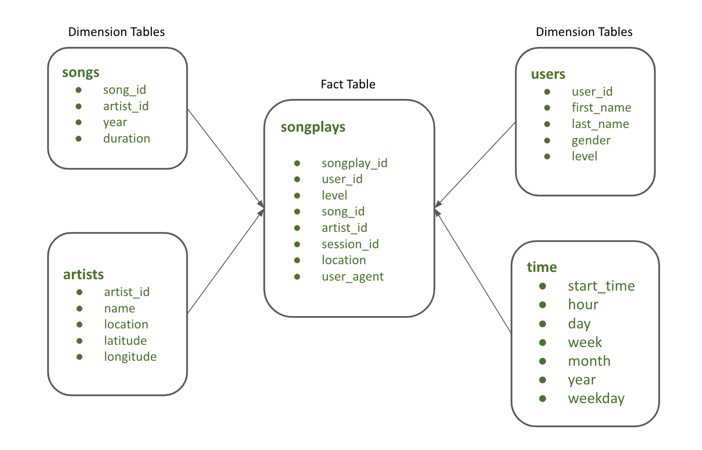
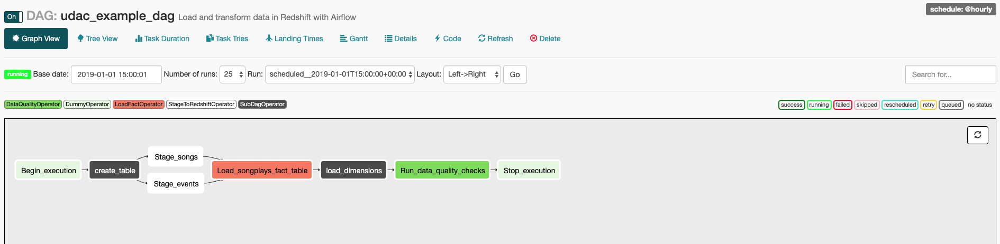
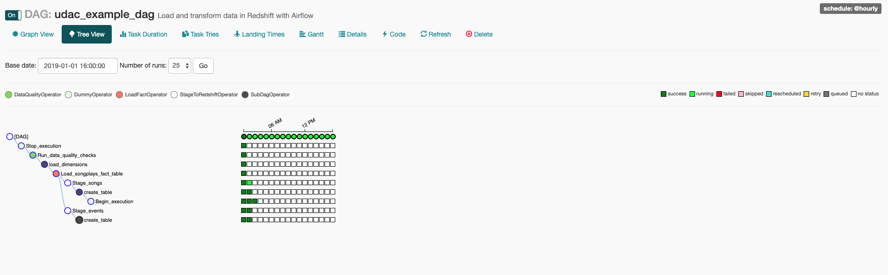

# Data Warehousing with Airflow and AWS
This project uses Apache Airflow to orchestrate the music streaming company's app data via Amazon Redshift.

## Background
A music streaming company, Sparkify, has decided that it is time to introduce more automation and monitoring to their data warehouse ETL pipelines and come to the conclusion that the best tool to achieve this is Apache Airflow. We have to create high grade data pipeline that is dynamic and built from reusable tasks, can be monitored, and allow easy backfills.    

Below data modelling structure is used in this project: <br> <br>


## Getting Started

Please note that the project comprises of the following structure: <br>
:pushpin: Create the AWS Redshift cluster using infrastructure as code. <br>
:pushpin: Run the airflow project. <br>
:pushpin: Delete the AWS Redshift cluster using infrastructure as code.<br>

Below are the steps to run: <br><br>
<b>STEP 1:</b> Load the code in your Udacity workspace. <br>
<b>STEP 2:</b> Run below command to create the Redshift cluster:
```
$ python aws/aws_starter --action create
```
STEP 3: Run below command to execute Airflow code:
```
$ /opt/airflow/start.sh
```
Once this command is successfully executed and you see the prompt back, click on the Airflow button at the bottom to open the Airflow web UI. <br><br>
<b>STEP 4: </b> Configure the following points in airflow:
Click on the Admin tab and select Connections.
Under Connections, select Create.
```bash
---- On the create connection page, enter the following values:
    |__ Conn Id: Enter aws_credentials.
    |__ Conn Type: Enter Amazon Web Services.
    |__ Login: Enter your Access key ID from the IAM User credentials you downloaded earlier.
    |__ Password: Enter your Secret access key from the IAM User credentials you downloaded earlier.

---- Once you have entered these values, select Save and Add Another.

---- On the next create connection page, enter the following values:
    |__ Conn Id: Enter redshift.
    |__ Conn Type: Enter Postgres.
    |__ Host: Enter the endpoint of your Redshift cluster, excluding the port at the end. You can find this by selecting your cluster in the Clusters page of the Amazon Redshift console. Alternatively, you can copy the host from the output of STEP 2 directly.
    |__ Schema: Enter dev. This is the Redshift database you want to connect to.
    |__ Login: Enter awsuser.
    |__ Password: Enter the password you created when launching your Redshift cluster.
    |__ Port: Enter 5439.

---- Once you have entered these values, select Save.

---- Next, click variables under admin tab and do the following:
    |__ Create a variable with key s3_bucket and value udacity-dend.
    |__ Create another variable with key s3_prefic and value data-pipelines.
```

<b>STEP 5: </b> Trigger the dag and monitor the tasks.

<b>STEP4: </b> Once, the dag execution is complete, run below command to close the Redshift cluster:
```
$ python aws/aws_starter --action delete

```

## Output from Airflow
Below image describes how DAG looks like in Airflow web UI. <br>
<br>
<b>Note: </b> <font color="green">I have created a slight modification in the recommended dag structure given as part of the project structure. I have included the subdag called <i>create_tables</i> just after the <i>begin_execution</i>. This subdag creates the table structure in the redshift cluster. Rest of the tasks are the same as demanded in the project instructions.</font>



Below is the image of the scheduler. <br>


### Authors
* **Rupali Sinha** - *Initial work*